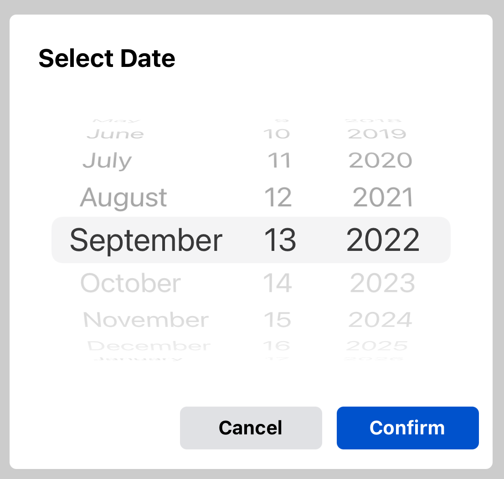
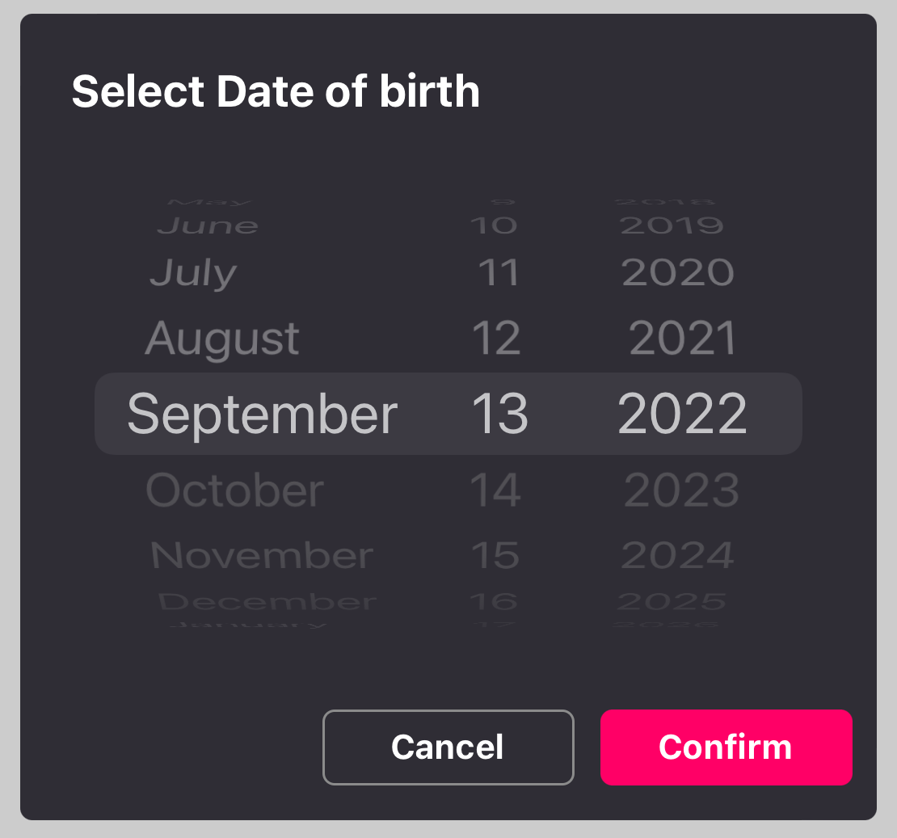

# react-native-customized-datepicker

A cross platform fully customisable and advanced date picker with flexibility to customise variety options built on top of react-native-date-picker.

This is a React Native Customized Date Picker with following main features:

📱&nbsp; Supports iOS, Android <br>
🕑&nbsp; 3 different modes: Time, Date, DateTime <br>
🎨&nbsp; Fully Customizable<br>

## Requirements

- Xcode >= 11.6
- React Native >= 0.57.
- If using React Native 0.64, 0.64.2 or later must be used.
- If using Expo, SDK 42 or later must be used. If using Expo SDK 44, 44.0.4 or later must be used.

## Installation

1. Download package and dependency with npm or yarn

```
npm install react-native-date-picker react-native-customized-datepicker
```

```
yarn add react-native-date-picker react-native-customized-datepicker
```

2. Install pods

```
cd ios && pod install
```

3. Rebuild the project

```
npx react-native run-android
npx react-native run-ios
```

## Example 1: Basic example with default styling

```jsx
import React, { useState } from "react";
import { Button } from "react-native";
import DatePicker from "react-native-customized-datepicker";

export default () => {
  const [date, setDate] = useState(new Date());
  const [open, setOpen] = useState(false);

  return (
    <>
      <Button title="Open" onPress={() => setOpen(true)} />
      <DatePicker
        date={date}
        visible={open}
        onConfirm={setDate}
        onCancel={setOpen}
      />
    </>
  );
};
```

## Basic Example Output



## Example 2: Example with customized styling

```jsx
import React, { useState } from "react";
import { Button } from "react-native";
import DatePicker from "react-native-customized-datepicker";

export default () => {
  const [date, setDate] = useState(new Date());
  const [open, setOpen] = useState(false);

  return (
    <>
      <Button title="Open" onPress={() => setOpen(true)} />
      <DatePicker
        date={date}
        visible={show}
        onCancel={setShow}
        onConfirm={setDate}
        backgroundColor={"#2F2D35"}
        pickerTitle={"Select Date of birth"}
        pickerTitleColor={"#FFFFFF"}
        cancelButtonTextColor={"#FFFFFF"}
        cancelButtonBackground={"#2F2D35"}
        cancelButtonBorderColor={"#8B8B8B"}
        confirmButtonBackground={"#FF0066"}
        theme={"dark"}
      />
    </>
  );
};
```

## Example with customized styling Output



## Props

| Prop                      | Description                                                                                                         |
| ------------------------- | ------------------------------------------------------------------------------------------------------------------- |
| `date`                    | The default or selected date [Required]                                                                             |
| `visible`                 | Boolean indicating datepicker visibility [Required]                                                                 |
| `onConfirm`               | Callback function to get the date after user selects and click on confirm button [Required]                         |
| `onCancel`                | Callback function to dismiss datepicker after user clicks on cancel button [Required]                               |
| `backgroundColor`         | Background Color of the datepicker default to #FFFFFF [Optional]                                                    |
| `pickerTitle`             | Title of datepicker default to "Select Date" [Optional]                                                             |
| `pickerTitleColor`        | Text Color of title default to #000000 [Optional]                                                                   |
| `cancelButtonText`        | Cancel button text default to "Cancel" [Optional]                                                                   |
| `confirmButtonText`       | Confirm button text default to "Confirm" [Optional]                                                                 |
| `confirmButtonBackground` | Confirm button background color default to #0052CC [Optional]                                                       |
| `cancelButtonBackground`  | Cancel button background color default to #E0E1E4 [Optional]                                                        |
| `cancelButtonTextColor`   | Cancel button text color default to #000000 [Optional]                                                              |
| `confirmButtonTextColor`  | Confirm button text color default to #FFFFFF [Optional]                                                             |
| `cancelButtonBorderColor` | Cancel button border color default to "transparent" [Optional]                                                      |
| `minimumDate`             | Minimum selectable date <br/> For Example : `new Date("2004-09-12")` [Optional]                                     |
| `maximumDate`             | Maximum selectable date <br/> For Example : `new Date("2022-01-31")` default to today's date [Optional]             |
| `androidVariant`          | Choose from 2 android style variants. `"iosClone"`, `"nativeAndroid"` [Optional]                                    |
| `modalAnimationType`      | Modal apperance animatiion choose from 3 animation variants "fade", "none" , "slide"; default to "slide" [Optional] |
| `theme`                   | iOS 13+: The theme of the modal. `"light"`, `"dark"`, `"auto"`. default to `"auto"`. [Optional]                     |
| `mode`                    | The date picker mode. `"datetime"`, `"date"`, `"time"` [Optional]                                                   |

## Support this package!

If you like this package, consider giving it a github star ⭐
Also, PR's are welcome!
